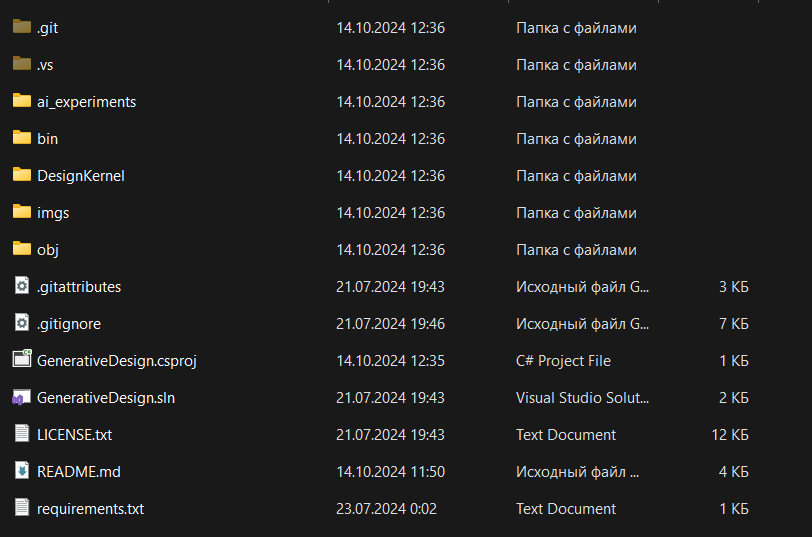

# Generative design

In this repository you will see some cases of AI-based generative design. It might not be possible without contribution of powerful library for computational engineering [PicoGK](https://github.com/leap71/PicoGK) by [Leap71](https://leap71.com/).

# Getting started

## Installation

To install this project and start to use it you should do the following steps:

1. Install Visual Studio 2022 following [this tutorial](https://github.com/leap71/PicoGK/blob/main/Documentation/VisualStudio_FirstTime.md)
2. Clone this repository to some directory on your machine. Now it is how your project folder looks like
    
    
    
3. Download PicoGK installer from [here](https://github.com/leap71/PicoGK/releases) (.exe file) and run it. Here you must choose some folder:
    
    
    
4. Open the folder from step 3. You should see the same picture
    
    
    
5. Select all files from PicoGK Example folder except PicoGK Example.csproj and Program.cs and copy them to your project folder. Then it should looks like this
    
    
    
6. Almost done! Now everything you need is installed, so you can try to test some functionalities. Open project with Visual Studio selecting the GenerativeDesign.sln file and run it. If pop-up window with something that seems like a strange car is appeared, than everything is alright.
    
    
    

If picture on your screen is different (perhaps the window is dark), [this tutorial](https://github.com/leap71/PicoGK/blob/main/Documentation/README.md#troubleshooting) can help you with troubleshooting.